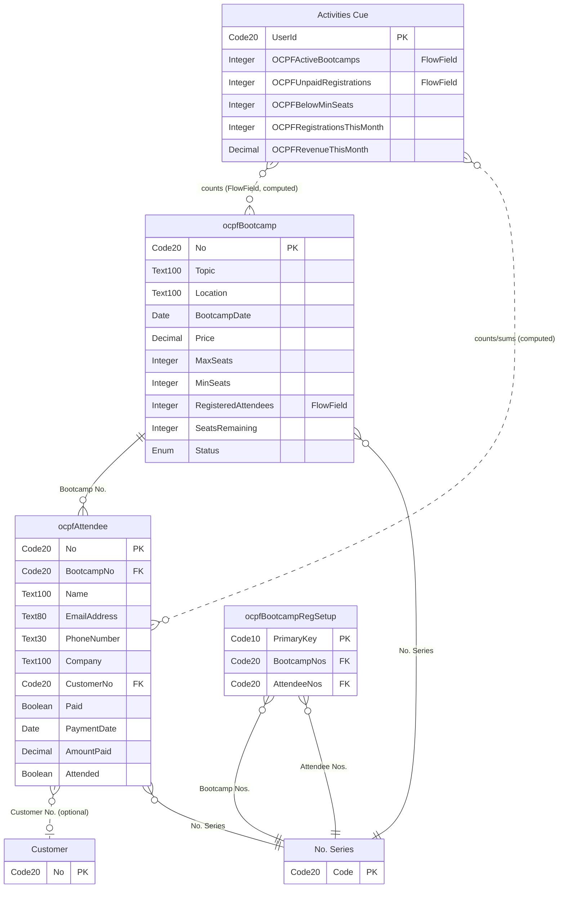

# Documentation — Bootcamp Registration Tracking API (v1.0)

**Phase:** PROVE · **Step:** 11 · **Audience:** developers, BI, and AI tooling integrating with this extension
**Date:** 2026-09-13 · **Generated from:** the shipped `.al` source (`src/`), not from memory — see
`docs/PostDevTDD.md` for the full as-built design.

> This is the **integration/API reference**. For the person clicking around inside Business
> Central, see `docs/UserGuide.md` instead — the two are deliberately separate documents.

---

## 1. Overview

Bootcamp Registration Tracking exposes two read/write OData v4 API entities under a custom API
group, **v1.0**:

| Entity set | Entity | Backing table | Mutability |
|---|---|---|---|
| `ocpfBootcamps` | `ocpfBootcamp` | `ocpfBootcamp` (60810) | Read/Write |
| `ocpfAttendees` | `ocpfAttendee` | `ocpfAttendee` (60820) | Read/Write |

The Bootcamp Registration Setup record and the Assisted Setup Wizard are **not** exposed via API
— they are one-time/administrative configuration, in-client only.

## 2. Quick start

### 2.1 Authentication

Like every Business Central API, this uses **Azure AD OAuth 2.0** — no separate credential
scheme of its own. Register an Azure AD app registration with the `Dynamics 365 Business
Central` API permission, obtain a bearer token (client-credentials flow for unattended
integrations, or authorization-code flow for a signed-in user), and send it as:

```
Authorization: Bearer <access_token>
```

### 2.2 URL pattern

```
https://api.businesscentral.dynamics.com/v2.0/{tenant}/{environment}/api/onlyCopilotFans/ocpfBootcampRegistration/v1.0/companies({companyId})/{entitySet}
```

| Placeholder | Where to get it |
|---|---|
| `{tenant}` | Your Azure AD tenant ID or domain |
| `{environment}` | The BC environment name (e.g. `Sandbox`, `Production`) |
| `{companyId}` | The target company's `SystemId` — GET `.../companies` first to find it |
| `{entitySet}` | `ocpfBootcamps` or `ocpfAttendees` |

`onlyCopilotFans` / `ocpfBootcampRegistration` are this extension's `APIPublisher` and
`APIGroup` — camelCase, no underscore separator, a deliberate divergence from the
`<Publisher>` / `<prefix>_<group>` literal example in this project's own naming standard
(see `PostDevTDD.md` §1). Use them exactly as shown; they are not guessable from the extension's
display name.

### 2.3 First request and response

```
GET https://api.businesscentral.dynamics.com/v2.0/{tenant}/{environment}/api/onlyCopilotFans/ocpfBootcampRegistration/v1.0/companies({companyId})/ocpfBootcamps
Authorization: Bearer <access_token>
```

```json
{
  "@odata.context": "...",
  "value": [
    {
      "systemId": "8a2e1f3c-....",
      "number": "BC00001",
      "topic": "AL Extension Development",
      "location": "",
      "bootcampDate": "2026-10-15",
      "price": 1500.00,
      "maxSeats": 20,
      "minSeats": 6,
      "registeredAttendees": 3,
      "seatsRemaining": 17,
      "status": "Active",
      "lastModifiedDateTime": "2026-09-13T14:02:11Z"
    }
  ]
}
```

## 3. Entity reference

### 3.1 `ocpfBootcamps`

| Field | Source | R/W | Notes |
|---|---|---|---|
| `systemId` | `SystemId` | Read-only | OData key (`ODataKeyFields = SystemId`) |
| `number` | `"No."` | Read/Write | Assigned from a No. Series if left blank on create |
| `topic` | `Topic` | Read/Write | Subject/title of the bootcamp |
| `location` | `Location` | Read/Write | Free text venue/city — not a BC warehouse Location |
| `bootcampDate` | `Bootcamp Date` | Read/Write | Single day; no start/end range |
| `price` | `Price` | Read/Write | LCY; seeds new attendees' `amountPaid` |
| `maxSeats` | `Max Seats` | Read/Write | `0` = no cap (see §5) |
| `minSeats` | `Min Seats` | Read/Write | Go/No-Go threshold — informational only, nothing automated |
| `registeredAttendees` | `Registered Attendees` (FlowField) | Read-only | Live count |
| `seatsRemaining` | `Seats Remaining` | Read-only | `maxSeats − registeredAttendees`, clamped to `0` when `maxSeats = 0` |
| `status` | `Status` (enum) | Read/Write | `Active` / `Inactive` / `Completed` / `Canceled` — manual only, nothing automated changes it |
| `lastModifiedDateTime` | `SystemModifiedAt` | Read-only | Standard BC change-tracking timestamp |

### 3.2 `ocpfAttendees`

| Field | Source | R/W | Notes |
|---|---|---|---|
| `systemId` | `SystemId` | Read-only | OData key |
| `number` | `"No."` | Read/Write | Assigned from a No. Series if left blank |
| `bootcampNo` | `Bootcamp No.` | Read/Write | **Required.** How an integration attaches a registration to a bootcamp. Setting/changing this seeds `amountPaid` from the bootcamp's `price` — see §5. |
| `name` | `Name` | Read/Write | Attendee full name |
| `email` | `Email Address` | Read/Write | Validated on write — see §6 |
| `phoneNumber` | `Phone Number` | Read/Write | |
| `company` | `Company` | Read/Write | Attendee's organization |
| `customerNo` | `Customer No.` | Read/Write | Optional link to an existing Customer; no auto-population |
| `paid` | `Paid` | Read/Write | Not validated against `paymentDate` |
| `paymentDate` | `Payment Date` | Read/Write | |
| `amountPaid` | `Amount Paid` | Read/Write | Seeded from the bootcamp price when `bootcampNo` is set/changed **and** the field is still `0`; an explicit value (including an explicit `0`) always wins — see §5 |
| `attended` | `Attended` | Read/Write | No check-in timestamp |
| `lastModifiedDateTime` | `SystemModifiedAt` | Read-only | |

## 4. `$filter` / `$select` examples

```
GET .../ocpfBootcamps?$filter=status eq 'Active'
GET .../ocpfBootcamps?$filter=seatsRemaining eq 0
GET .../ocpfAttendees?$filter=bootcampNo eq 'BC00001' and paid eq false
GET .../ocpfAttendees?$select=number,name,amountPaid,paid
GET .../ocpfBootcamps?$filter=lastModifiedDateTime gt 2026-09-01T00:00:00Z&$orderby=lastModifiedDateTime
```

The last example is the standard incremental-sync pattern for any BC API entity: poll on
`lastModifiedDateTime` rather than pulling the full collection each time.

## 5. Create / update examples

**Create a bootcamp:**
```
POST .../ocpfBootcamps
{ "topic": "Business Central for Consultants", "bootcampDate": "2026-11-05",
  "price": 1500.00, "maxSeats": 20, "minSeats": 6 }
```
`number` and `status` (defaults to `Active`) may be omitted.

**Register an attendee — the normal case, amount seeds automatically:**
```
POST .../ocpfAttendees
{ "bootcampNo": "BC00001", "name": "Jordan Lee", "email": "jordan@example.com" }
```
Response includes `"amountPaid": 1500.00` — copied from the bootcamp's `price` because
`bootcampNo` was set and `amountPaid` was not supplied (implicitly `0`).

**Register a comped (free) attendee — the case this API was specifically fixed to support
correctly (ChangeLog STEP09-02, BP-1):**
```
POST .../ocpfAttendees
{ "bootcampNo": "BC00001", "name": "Sam Rivera", "email": "sam@example.com", "amountPaid": 0 }
```
Response includes `"amountPaid": 0` — the explicit `0` is honored and is **never** silently
overwritten to the bootcamp's price later, including if the attendee's `bootcampNo` is later
changed to a *different* value while `amountPaid` is still `0` (that specific case does re-seed —
see `PostDevTDD.md` §3.7 for the documented edge case).

**Update a field:**
```
PATCH .../ocpfAttendees(<systemId>)
If-Match: *
{ "paid": true, "paymentDate": "2026-09-13" }
```

**Attempt to write a read-only field — rejected:**
```
PATCH .../ocpfBootcamps(<systemId>)
{ "seatsRemaining": 99 }
```
→ `400 Bad Request`, an error naming the field as not editable. `seatsRemaining`,
`registeredAttendees`, `systemId`, and `lastModifiedDateTime` are all platform-maintained.

**Delete a bootcamp that still has attendees — blocked:**
```
DELETE .../ocpfBootcamps(<systemId>)
```
→ error: *"You cannot delete bootcamp BC00001 because attendee registrations exist for it.
Delete the registrations first."* Delete the attendee records first, or don't delete the
bootcamp.

## 6. Limitations

- The Bootcamp Registration Setup record and the Assisted Setup Wizard are not exposed via API.
- Registering an attendee past `maxSeats` **never blocks via API** — the in-client overbooking
  confirmation is a `Confirm()` dialog, which is skipped silently whenever there is no
  interactive user (`GuiAllowed = false`, always true for an API call). An integration is
  expected to check `seatsRemaining` itself first if it needs to warn a caller.
- No currency handling — all amounts are the company's local currency; there is no Currency Code
  field.
- No tax fields of any kind.
- `amountPaid` seeding happens once, at the moment `bootcampNo` is set or changed, not on every
  write — see §5's comped-attendee example and `PostDevTDD.md` §3.7 for the full rule and its one
  documented edge case.
- Deleting an `ocpfAttendee` is always allowed (no dependents); deleting an `ocpfBootcamp` with
  attendees is always blocked.

## 7. Common integration patterns

| Scenario | Pattern |
|---|---|
| External web registration form | `POST ocpfAttendees` with `bootcampNo` + contact fields. Leave `amountPaid` out entirely to accept the bootcamp's price, or send `amountPaid: 0` for a comp. |
| BI / reporting sync | Read-only polling of both entity sets, filtered on `lastModifiedDateTime` for incremental refresh (§4). |
| AI tooling | Conversational read/write against the same two endpoints — no separate AI-specific surface exists or is needed. |
| Keeping an external roster in sync | Match on `number` (this app's own No. Series) or `systemId` (stable across renames); `number` can change if a user manually renames a record, `systemId` never does. |

## 8. Troubleshooting

| Symptom | Cause | Fix |
|---|---|---|
| `401 Unauthorized` | Missing/expired/invalid bearer token | Re-authenticate; check the Azure AD app registration's API permissions |
| `403 Forbidden` opening any endpoint | The calling user/app doesn't have `OCPF - Bootcamp Read` (or `Edit`) assigned | Assign the appropriate OCPF permission set — see `Deployment.md` §4 |
| `400 Bad Request`, "Bootcamp No. must have a value" | Tried to create an attendee without `bootcampNo` | `bootcampNo` is required on every attendee |
| `400 Bad Request` on a field like `seatsRemaining` or `registeredAttendees` | Attempted to write a platform-maintained read-only field | Remove that field from the request body |
| `400 Bad Request`, "cannot be found" on `bootcampNo` or `customerNo` | The referenced Bootcamp/Customer number doesn't exist | Verify the number first with a `GET`, or create the parent record first |
| `400 Bad Request`, "is not valid" on `email` | Failed the email format check (needs exactly one `@`, no spaces, a `.` after the `@`) | Correct the address or leave it blank — email is optional |
| Delete on `ocpfBootcamps` fails with an actionable message | Attendees still reference that bootcamp | Delete the attendees first (§5) |
| `amountPaid` shows the bootcamp price when a `0` was expected | `bootcampNo` was set/changed with `amountPaid` already at `0` — this re-seeds by design | Set `amountPaid: 0` explicitly *after* `bootcampNo` is final, or in the same request |

## 9. Schema diagram

Every table this extension owns, plus every standard/base table it touches (`TableRelation`,
`tableextension`, or a `pageextension`'s `RunPageLink`). Rendered and visually verified before
publishing this document (`npx @mermaid-js/mermaid-cli`, 2026-09-13) — see
`docs/ChangeLog.md` Issue STEP11-01.



`ocpfBootcampRegSetup` is a singleton, not part of the API surface (§1), but is included here
because it's a table this extension owns and it references `No. Series` twice. `Activities Cue`
relationships are dashed/non-identifying: they are computed (2 FlowFields, 3 values recomputed on
Role Center refresh by `ocpfActivityCueMgt`), not stored foreign keys.
